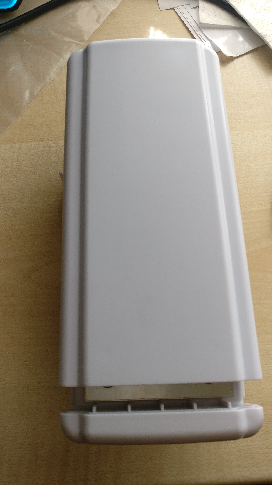
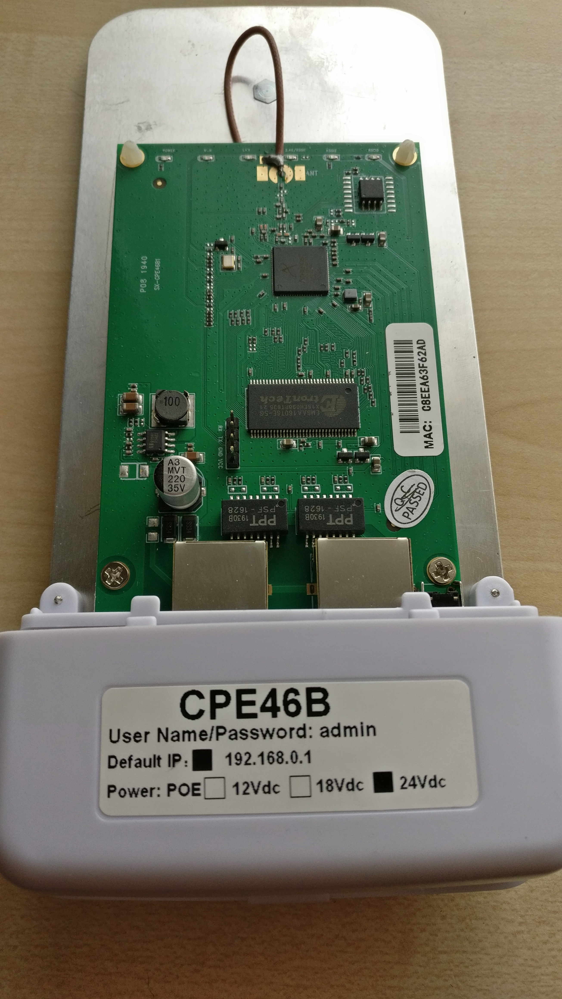
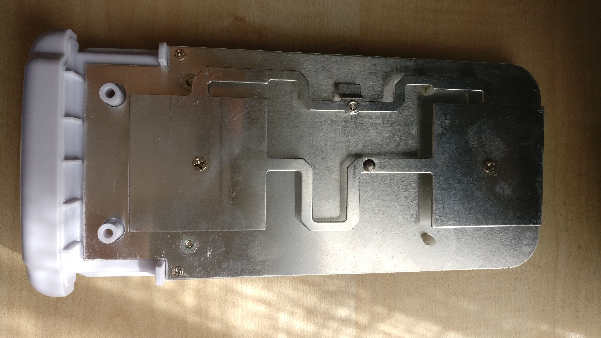
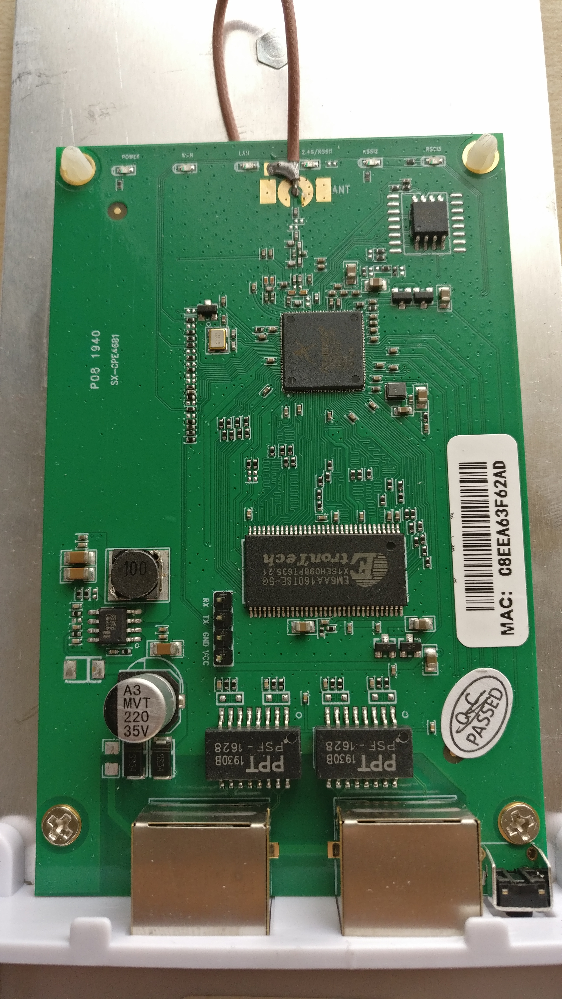
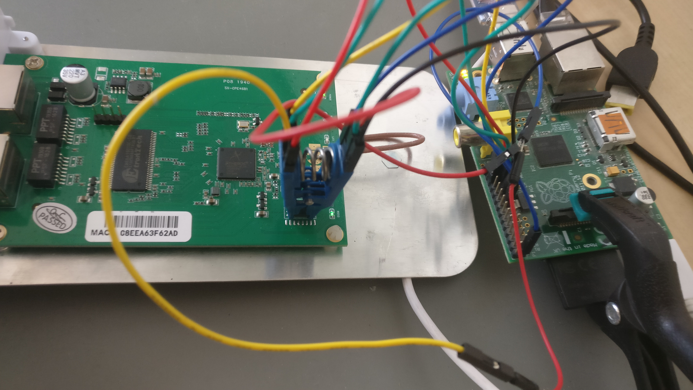
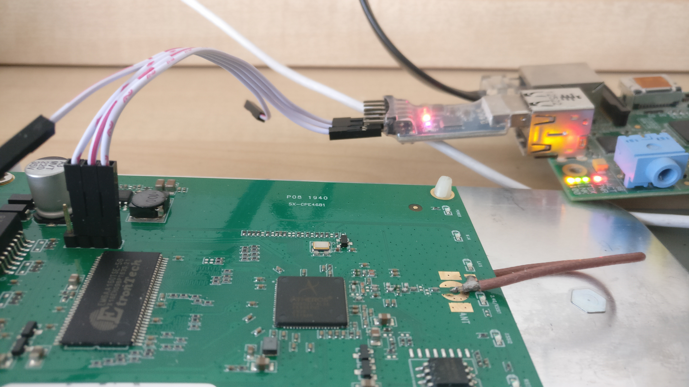

## This is a copy! I am not the original creator!
I just found this write up to be useful for my own porting adventure. I am making this copy for myself to use and to preserve. 

I found the write up through [this Reddit post](https://www.reddit.com/r/openwrt/comments/gyfit0/guide_on_porting_openwrt_to_devices_with_an/) and the orginal link is this [Gitea page](https://git.lsd.cat/g/openwrt-cpe46b).

I am extracting the contents from [this snapshot](https://web.archive.org/web/20260310214817/https://git.lsd.cat/g/openwrt-cpe46b) of the page. All text and images will be left as is, with the formatting being eyeballed by hand. 

## Update
[The device tree been reviewed and succesfully merged. Snapshot are now available!](https://web.archive.org/web/20260310214817/https://git.openwrt.org/?p=openwrt/openwrt.git;a=commit;h=b108ed0ab09492d8d5a1775714da1ee34ce475ee)

## Intro
Recently, some network devices caught my attention both on Aliexpress and Alibaba. Specifically, I found some interesting outdoor equipment for a very low price, ranging between 10-25$.

- https://it.aliexpress.com/item/32964460654.html
- https://it.aliexpress.com/item/4000091742124.html
- https://www.alibaba.com/product-detail/AR9331-long-range-wifi-192-168_62106638650.html

These are 2.4ghz AR9330 based boards, powered via POE (although on a nonstandard voltage), with two 10/100/1000 Ethernet ports, an integrated antenna, and a waterproof enclosure. I received the first one from Aliexpress but I plan to get some other to test as well.

[There's a video on YouTube of someone unpacking and reviewing it.](https://web.archive.org/web/20260310214817/https://www.youtube.com/watch?v=i3WUmMOqit0) It also shows the OEM web interface.

## Pictures





## PCB
From the PCB picture it is clear that the board has an easily accessible serial header and that it has a SOIC8 flash chip (Winbond 25Q64). Given this info, there are two possibilities to start learning about the board via hardware: connecting to the serial console and get whatever the oem firmware prints out and do a direct hardware image of the flash chip.

## Dumping firmware
### Dumping the original firmware without hardware
Before even trying the SOIC clip or the serial port I wanted to check around the stock firmware. It looks like the device has no DHCP server but it has a fixed 192.168.0.1 IP address and default admin:admin credentials. By default, there's only the web interface and a telnet server listening on the public interface. The credentials for the telnet interface are root without a password.
```
CPE46B mips #1 Thu Sep 5 18:02:48 CST 2019 (none)
CPE46B login: root
Ziking logintalk start ...................

Interactive mode

> help
 help                          :Show this usage help
 art.sh                        :Run art server
 get_log                       :Download log from ap to remote.  Usage: get_log [remote ip]
 ifconfig                      :Network configuration commands
 ip                            :Network configuration commands
 iwconfig                      :Wlan configuration commands
 iwpriv                        :Wlan configuration commands
 iwlist                        :Wlan configuration commands
 oem                           :Change/Show MAC address & sn; Usage: oem get/set
 ping                          :Command ping
 ps                            :Command ps
 route                         :Network configuration commands
 sendAT                        :Send AT command for lte device
 show_oem                      :Show OEM infomation
 show_ver                      :Show AP software version
 tc                            :Qos configuration commands
 top                           :Command top
 wlanconfig                    :Athreos wlan configuration commands
 T1                            :Test 5G RF with 20M bandwidth
 T2                            :Test 5G RF with 40M bandwidth
 T3                            :Test 2.4G RF with 20M bandwidth
 T4                            :Test 2.4G RF with 40M bandwidth
 T5                            :Test upload.Usage: T5 [remote ip]
 T6                            :Test download.Usage: T6
>
```

While upon collecting the user is dropped in a restricted prompt with few commands available, it is possible to inject commands in almost any of it via common shell separators `|;&`. With the command injection is easy to understand that the device is already running a heavily customized OpenWrt fork, running on `Linux 2.6.31`.
```
> iwconfig|uname -a
lo        no wireless extensions.

eth0      no wireless extensions.

eth1      no wireless extensions.

wifi0     no wireless extensions.

br0       no wireless extensions.

Linux CPE46B 2.6.31--LSDK-9.2.0_U9.915 #1 Thu Sep 5 18:02:48 CST 2019 mips GNU/Linux
```
Catting /proc/mtd gives more info about the flash layout.
```
> iwconfig|cat /proc/mtd
dev:    size   erasesize  name
mtd0: 00010000 00010000 "u-boot"
mtd1: 00010000 00010000 "u-boot-env"
mtd2: 00360000 00010000 "rootfs"
mtd3: 00100000 00010000 "uImage"
mtd4: 00360000 00010000 "rootfs1"
mtd5: 00010000 00010000 "NVRAM"
mtd6: 00010000 00010000 "ART"
```
And /proc/cpuinfo about the SoC and the CPU.
```
> iwconfig|cat /proc/cpuinfo
system type             : Atheros AR9330 (Hornet)
processor               : 0
cpu model               : MIPS 24Kc V7.4
BogoMIPS                : 266.24
wait instruction        : yes
microsecond timers      : yes
tlb_entries             : 16
extra interrupt vector  : yes
hardware watchpoint     : yes, count: 4, address/irw mask: [0x0000, 0x0020, 0x0020, 0x0588]
ASEs implemented        : mips16
shadow register sets    : 1
core                    : 0
VCED exceptions         : not available
VCEI exceptions         : not available
```
By knowing the size of each mtd partition, we get to know that it has a 8MiB flash chip. This makes sense given that the chip has written on it `25Q64`, where `64` is the size in Megabits.

Using `dd` it is possible to dump each partition, download it and even reassemble the full firmware image simply with `cat` afterwards.

for X in 0..6

`> iwconfig|dd if=/dev/mtd0 of=/var/tmp/web/mtdX`

for X in 0..6

```
# wget http://192.168.0.1/mtdX

# cat mtd0 mtd1 mtd2 mtd3 mtd4 mtd5 mtd6 > flash.bin

# ls -lart flash.bin
-rwxrwxrwx 1 user user 8388608 Apr 12 12:40 flash.bin
```
Also do a `sha1sum` of the final file. It should match the image extracted later via the SOIC Clip.

Where `8388608/1024=8192K`.

When the device boots up, a lot of custom scripts and services will run. The most custom part of the firmware, which means the web interface and their custom binaries are somehow encrypted or more simply obfuscated and loaded at runtime in ram. At rest, the obfuscated files are called `/usr/web.bin`, `/usr/sbin.bin`, `/usr/apps.bin`. The executable responsible for decrypting them to more simpler tgz archives is called ap_monitor. Ghidra successfully decompile this binary and the obfuscation mechanism is not very complicated and could be reversed with not too much effort but there's probably no reason to do so.

Since I was unable to find the manufacturer both on the package or anywhere else, I'll refer to it as `ZiKing` as it seems that's the name stated in their own proprietary config file. On Aliexpress, the same device is also often said to be made by `ANDDEAR`. Both do not seem to have any presence on the English internet.
```
FID="OEM"
FLASH_ID="SPI"
PCB="v1.0"
PN="CPE46B"
PT="AP"
VER="4.3.7"
VER1="4.3.7"
RF_MODE="1T1R"
WAN="0"
EXT_PA="1"
TRSW="1"
SERVER_DOMAIN="www.ziking.net"
DHCPD_EVER="0"
IANA="37260"
MAXNUM=4

####language
CSS_STYLE="SHX46B"
LANG="en"
SUPPORT_LANG="en,zh"
COUNTRYCODE="76"
SUPPORT_COUNTRYCODE="76,156,276,392"
####radio & vaps
MAX_VAPS="8"
MAX_RFS="1"
#0: auto, 1:2.4G, 2-5.8G
RF0_SUPPORT_FREQ="1"
#RF1_SUPPORT_FREQ="0"

SUPPORT_AUTO_ACTIVE="0"
#### product Type
###0: FIT AP mode
###1: WIFI CPE mode
###2: LTE/3G CPE mode
###3: Route mode
####for UPNP
MANUFACTURER="XIAN ZIKING NETWORK COMMUNICATIONS CO.,LTD."
MANUFACTURERURL="http://www.ziking.net"
MODELDESCRIPTION="Wireless Broadband Access Point / CPE"
####
PRODUCT_TYPE="1"
SUPPORT_PRODUCT_TYPE="2,3"
SUPPORT_WAN_MODE="251"
SUPPORT_AUTH_MODE="63"
SUPPORT_WLAN_MODE="7"
SUPPORT_MAC_MAP="0"
PRODUCT_ID="0"
APSYSNEID="SYSNEIDatleast16chars1234567890123456"
AP_NASID="NASIDatleast16chars1234567890123456"
APSYSHOSTNAME="APNAMEatleast40chars1234567890123456789012345678901234567890"
AP_LOCATION="shenzhen"
AP_COVERAGETYPE="2"
AP_DESCRIPRION="Customer Premise Equipment"
AP_SOFT_VERDOR="ZiKing"
AP_ORIG_VENDOR="ZiKing"
AP_CPU="ar9331"
CPU_SPEED="400000000"
#it must be xxMB(type)
AP_MEMORY="64MB(S29GL064M)"
AP_FLASH="8MiBB(HY57V561620TP-H)"
#max power, dbm
AP_MAX_POWER="15"
PCB0="SX933146B"
BUS="AHB"
SUPPORT_AC_CURL_MGR="0"
AP_SERIALNUMBER=001122334455
```

Note that the `64MiB` RAM value written there is wrong. This one has `32MiB` but it probably depends on the production batch.

The only thing actually existing, given that as of now the website shows a default page, is [their IANA assignment number](https://web.archive.org/web/20260310214817/https://oidref.com/1.3.6.1.4.1.37260).

### Raspberry PI GPIO with a SOIC8 CLIP


[The following instructions are recycled from this other guide.](https://web.archive.org/web/20260310214817/https://git.lsd.cat/g/thinkpad-coreboot-qubes/src/master/README.md)

WARNING: The Raspberry VCC will five some power also to the SoC. This means that there might be interference given the unknown state of the SoC while working on the flash chip. In my case, that lead to some verifying errors after a write, but the write itself never failed.

```
    ______
1--| O    |--8
2--|      |--7
3--|      |--6
4--|______|--5
```
Remember to research your chip model and manufacturer and double-check the pin layout using the official datasheet.

|1|2|3|4|5|6|7|8|Flash pin number|
|-|-|-|-|-|-|-|-|-|
|CS|DO|/WP|GND|DI|CLK|/HOLD|VCC|Pin name|
|24|21|GND|25|19|23|GND|17|Rpi GPIO number|

Please refer to the multiple flashing guides available
- https://www.flashrom.org/RaspberryPi
- https://libreboot.org/docs/install/rpi_setup.html
- https://karlcordes.com/coreboot-x220/
- https://tylercipriani.com/blog/2016/11/13/coreboot-on-the-thinkpad-x220-with-a-raspberry-pi/
- https://github.com/bibanon/Coreboot-ThinkPads/wiki/Hardware-Flashing-with-Raspberry-Pi

```
# flashrom -p linux_spi:dev=/dev/spidev0.0,spispeed=1000 -r flash1.bin
# flashrom -p linux_spi:dev=/dev/spidev0.0,spispeed=1000 -r flash2.bin
# flashrom -p linux_spi:dev=/dev/spidev0.0,spispeed=1000 -r flash3.bin
# sha1sum flash*.bin
```

Check that all the checksums do match (also with the dump obtained via `dd` and `cat`). In case they don't there's probably something wrong in the clip position or in the wiring. Remember that no pin should left floating even if it's not useful for the operation. /WP and /HOLD should be always connected to something like GND or VCC.

A working alternative is to use a CH341 USB. In this case, an external VCC source is needed.

For more information about In-System Programming, [visit the flashrom wiki](https://web.archive.org/web/20260310214817/https://www.flashrom.org/ISP).

### Serial interface


The serial header is easy to work with and has clearly written the pinout on it. Any cheap USB adapter will probably work. In my case the baud rate is 115200, however, a script like [baudare.py](https://web.archive.org/web/20260310214817/https://github.com/somu1795/baudrate) should do the trick.

Common software for serial communication are `minicom` and `screen`.
```
# screen /dev/ttyUSB0 115200
```
## Porting
### Partition layout
The info learnt from `/proc/mtd` are extremely useful.

- `mtd0 u-boot` is a 64KiB partition which contains the u-boot bootloader
- `mtd1 u-boot-env` is a 64KiB partition containing the u-boot configuration
- `mtd2 rootfs` is a jffs2 partition containing the actual image
- `mtd3 uImage` is a squashfs kernel image
- `mtd4 rootfs1` is a jffs2 partition containing a secondary image, probably used for recovery
- `mtd5 NVRAM` is a 64KiB partition which contains a `tgz` for OEM system configuration files
- `mtd6 ART` is a 64KiB partition [that contains calibration data for the radio chip](https://web.archive.org/web/20260310214817/https://github.com/pepe2k/ar9300_eeprom)

The total size is of course 8192KiB. The partitions are not partitions in an EXT or NTFS sense. The data is just contiguous on the flash but the bootloader and the kernel are responsible for considering the different regions separate.

That's the reason because `cat` works and it is so simple to work with them.

Since for vanilla OpenWrt a custom partition for configuration is not needed, and two rootfs aren't useful and everything can be packed in a single partition with more space for packages and user data our target could be:
- `mtd0 u-boot` original image
- `mtd1 u-boot-env` some values here needs to be modified
- `mtd2 firmware` 8000K OpenWrt partition (`firmware` is the standard OpenWrt naming)
- `mtd3 ART` original image

On some other devices this is not needed because maybe the partition layout already makes sense: ie there's already a single partition with kernel and data. They are a bit easier to play with because in that case there's probably no need to manipulate the boot environment. Furthermore, in this case, building an image for flashing trough the OEM web interface might be not possible.

### U-Boot
U-boot is an Open Source Bootloader mainly for embedded devices. While it is actively developed, the actual version depends on the SDK a vendor provides for its SoC.

Atheros, for `ar9330` seems to have used 1.4 as base, which is almost a decade old.

Here's the u-boot log from the serial interface:
```

U-Boot 1.1.413 (Aug 29 2012 - 10:36:47)

AP121-2MB (ar9330) U-boot
DRAM:  32 MB
flash size 8388608, sector count = 128
Flash:  8 MB
In:    serial
Out:   serial
Err:   serial
Net:
eth0: c8:ee:a6:3f:62:ad
eth0 up
eth1: 00:0a:0b:0c:0d:0e
eth1 up
eth0, eth1
Hit any key to stop autoboot:  0
## Booting image at 9f380000 ...
   Image Name:   Linux Kernel Image
   Created:      2019-09-05  10:02:56 UTC
   Image Type:   MIPS Linux Kernel Image (lzma compressed)
   Data Size:    864262 Bytes = 844 kB
   Load Address: 80002000
   Entry Point:  801d0de0
   Verifying Checksum at 0x9f380040 ...OK
   Uncompressing Kernel Image ... OK
No initrd
## Transferring control to Linux (at address 801d0de0) ...
## Giving linux memsize in bytes, 33554432

Starting kernel ...

Booting AR9330(Hornet)...
init started: BusyBox v1.15.0 (2019-09-05 18:04:35 CST)
starting pid 19, tty '': '/etc/rc.d/rcS'
Isking Copyright 2016....
Not support pin simple config
Not found /etc/rc.d/rc.getethdev
Not found /etc/rc.d/rc.fs
load driver
  adf loaded sucessfully
  asf loaded sucessfully
  ath_hal loaded sucessfully
  ath_rate_atheros loaded sucessfully
  ath_dev loaded sucessfully
  umac loaded sucessfully
2
starting pid 301, tty '': '/bin/getty ttyS0 115200'

 CPE46B mips #1 Thu Sep 5 18:02:48 CST 2019 (none)
CPE46B login:
```

This confirms most of what we have got to know from the OEM firmware, 8MiB flash, 32MiB RAM, AR9330 SoC. Hornet is the codename for a [specific ALFA board](https://web.archive.org/web/20260310214817/https://openwrt.org/toh/alfa_network/hornet-ub), and probably its target has been recycled for this U-Boot build.

U-Boot has the possibility to drop the user to an interactive command prompt if a key is pressed on the early boot phase:
```
U-Boot 1.1.413 (Aug 29 2012 - 10:36:47)

AP121-2MB (ar9330) U-boot
DRAM:  32 MB
flash size 8388608, sector count = 128
Flash:  8 MB
In:    serial
Out:   serial
Err:   serial
Net:
eth0: c8:ee:a6:3f:62:ad
eth0 up
eth1: 00:0a:0b:0c:0d:0e
eth1 up
eth0, eth1
Hit any key to stop autoboot:  0
ar7240> help
padfix  - fixed uboot bug
?       - alias for 'help'
bdinfo  - print Board Info structure
boot    - boot default, i.e., run 'bootcmd'
bootd   - boot default, i.e., run 'bootcmd'
bootm   - boot application image from memory
cp      - memory copy
erase   - erase FLASH memory
help    - print online help
loadb   - load binary file over serial line (kermit mode)
loads   - load S-Record file over serial line
loady   - load binary file over serial line (ymodem mode)
md      - memory display
mm      - memory modify (auto-incrementing)
mw      - memory write (fill)
ping    - send ICMP ECHO_REQUEST to network host
printenv- print environment variables
progmac - Set ethernet MAC addresses
protect - enable or disable FLASH write protection
reset   - Perform RESET of the CPU
run     - run commands in an environment variable
saveenv - save environment variables to persistent storage
setenv  - set environment variables
tftpboot- boot image via network using TFTP protocol
version - print monitor version
wd      - check and set watchdog
ar7240>
```
Note: `ar7240>` is probably there just because someone forgot to edit the prompt to the correct chipset name. It's just a static name and it is irrelevant.

The `printenv` prints out the current u-boot environment:
```
ar7240> printenv
bootargs0=console=ttyS0,115200 root=31:02 rootfstype=squashfs,jffs2 init=/bin/init mtdparts=ar7240-nor0:64k(u-boot),64k(u-boot-env),3456k(rootfs),1024K(uImage),3456k(rootfs1),64k(NVRAM),64k(ART)
bootcmd0=bootm 0x9f380000
bootargs1=console=ttyS0,115200 root=31:04 rootfstype=squashfs,jffs2 init=/bin/init mtdparts=ar7240-nor0:64k(u-boot),64k(u-boot-env),3456k(rootfs),1024K(uImage),3456k(rootfs1),64k(NVRAM),64k(ART)
bootcmd1=bootm 0x9f380000
baudrate=115200
ethaddr=0x00:0xaa:0xbb:0xcc:0xdd:0xee
ethact=eth0
filesize=27d000
fileaddr=80060000
ipaddr=192.168.0.144
serverip=192.168.0.141
bootparam=0
bootdelay=4
runver1=AWS-SX9331027-4.3.3
runver0=OEM-SX933146B-4.3.7
LANG=en
stdin=serial
stdout=serial
stderr=serial
ver=U-Boot 1.1.413 (Aug 29 2012 - 10:36:47)
bootargs=console=ttyS0,115200 root=31:02 rootfstype=squashfs,jffs2 init=/bin/init mtdparts=ar7240-nor0:64k(u-boot),64k(u-boot-env),3456k(rootfs),1024K(uImage),3456k(rootfs1),64k(NVRAM),64k(ART)
bootcmd=bootm 0x9f380000

Environment size: 978/65532 bytes
```
The same information can be obtained by running `strings` on the `mtd1` partition image.

As seen above, the `bootargs` variable contains the serial console information, the partition scheme, and the init information. So any change in the partition scheme must be reflected in this variable. The other important value is `bootcmd`: it contains the actual boot command. The address there is the starting address of the partition that contains the kernel image (with a `0x9f` prefix).

So, given 0x0038000 which is `3670016/1024=3584KiB`. So by summing up the size of `mtd0`, `mtd1`, and `mtd2` the total should be the `mtd3` starting address: `64+64+3456=3584KiB`.

So while we don't have our OpenWrt image yet, let's try to write the new variables for the new partition scheme described in the previous section:
```
bootargs=console=ttyS0,115200 root=31:02 rootfstype=squashfs,jffs2 init=/bin/init mtdparts=ar7240-nor0:64k(u-boot),64k(u-boot-env),8000k(firmware),64k(ART)
bootcmd=bootm 0x9f020000
```
Where, `root=31:02` stands for the `mtd2` partition which is labelled firmware. The `bootcmd` address is `0x0002000` which is 128KiB. `8000k` is the OpenWrt partition size.

However, it looks like now the `root` and `mtdparts` parameters are no longer needed since the DTS is built into the image (more on this later). Also, the default init for OpenWrt is `/sbin/init` so that may be omitted too.

The following environment should be sufficient:
```
bootargs=console=ttyS0,115200 rootfstype=squashfs,jffs2 
bootcmd=bootm 0x9f020000
```
#### Changing u-boot environment
U-boot ships also with the commands `setenv` and `saveenv`. The first one will change or add a variable in the current session, the second one will write the current state on the u-boot-env partition.
```
ar7240> setenv bootargs0
ar7240> setenv bootcmd0
ar7240> setenv bootargs1
ar7240> setenv bootcmd1
ar7240> setenv bootargs console=ttyS0,115200 root=31:02 rootfstype=squashfs,jffs2 init=/bin/init mtdparts=ar7240-nor0:64k(u-boot),64k(u-boot-env),8000k(firmware),64k(ART)
ar7240> setenv bootcmd bootm 0x9f020000
ar7240> saveenv
Saving Environment to Flash...
Protect off 9F010000 ... 9F01FFFF
Un-Protecting sectors 1..1 in bank 1
Un-Protected 1 sectors
Erasing Flash...Erase Flash from 0x9f010000 to 0x9f01ffff in Bank # 1
First 0x1 last 0x1 sector size 0x10000                                                                                                                                                                                                      1
Erased 1 sectors
Writing to Flash... write addr: 9f010000
done
Protecting sectors 1..1 in bank 1
Protected 1 sectors
ar7240> printenv
baudrate=115200
ethaddr=0x00:0xaa:0xbb:0xcc:0xdd:0xee
ethact=eth0
filesize=27d000
fileaddr=80060000
ipaddr=192.168.0.144
serverip=192.168.0.141
bootparam=0
bootdelay=4
runver1=AWS-SX9331027-4.3.3
runver0=OEM-SX933146B-4.3.7
LANG=en
stdin=serial
stdout=serial
stderr=serial
ver=U-Boot 1.1.413 (Aug 29 2012 - 10:36:47)
bootargs=console=ttyS0,115200 root=31:02 rootfstype=squashfs,jffs2 init=/bin/init mtdparts=ar7240-nor0:64k(u-boot),64k(u-boot-env),8000k(firmware),64k(ART)
bootcmd=bootm 0x9f020000

Environment size: 498/65532 bytes
```
#### Warning
The following method has not worked with me, but I'm documenting it anyway.

As for the u-boot environment, it is possible to create an entirely new `u-boot-env` data using an utility called `mkenvimage` which is shipped within the u-boot source. Simply write all the parameters in a file called `env.txt`
```
baudrate=115200
ethaddr=0x00:0xaa:0xbb:0xcc:0xdd:0xee
stdin=serial
stdout=serial
stderr=serial
ver=U-Boot 1.1.413 (Aug 29 2012 - 10:36:47)
bootargs=console=ttyS0,115200 root=31:02 rootfstype=squashfs,jffs2 init=/bin/init mtdparts=ar7240-nor0:64k(u-boot),64k(u-boot-env),8000k(firmware),64k(ART)
bootcmd=bootm 0x9f020000
ethact=eth0
filesize=27d000
fileaddr=80060000
ipaddr=192.168.0.144
serverip=192.168.0.141
bootparam=0
bootdelay=4
runver1=AWS-SX9331027-4.3.3
runver0=OEM-SX933146B-4.3.7
LANG=en
```
And run `./mkenvimage -s 0x01000 -o env.bin env.txt`. The output should be a 64KiB env.bin.
## Buidling OpenWRT
Adding a device target for an already supported SoC shouldn't be a difficult task. The OpenWrt wiki has some pages that help understand the process:
- https://openwrt.org/docs/guide-developer/add.new.device
- https://openwrt.org/docs/guide-developer/defining-firmware-partitions

So what need to be done is:
- Find out the target partition scheme
- Find out led and button GPIO
- Add additional board specific files (for network, calibration, etc)

One of the best ways to understand the process is to look at recent commits that add supports for some device, especially if with the same SoC. As an example reference, I used the [Comfast CF-EW72 target](https://web.archive.org/web/20260310214817/https://git.openwrt.org/?p=openwrt/openwrt.git;a=commit;h=7daab6286110b95167e291409395494f18edc9dc).

I copied a DTS of the same SoC, specifically `./target/linux/ath79/dts/ar9330_glinet_gl-ar150.dts` in the OpenWrt source tree, adjusted the partition scheme, removed the GPIO info that I don't have yet, checked that the ART partition offsets do match with mine. Here's the result:
```
// SPDX-License-Identifier: GPL-2.0-or-later OR MIT
/dts-v1/;

#include <dt-bindings/gpio/gpio.h>
#include <dt-bindings/input/input.h>

#include "ar9330.dtsi"

/ {
        model = "ZiKing CPE46B";
        compatible = "ziking,cpe46b", "qca,ar9330";

        aliases {
                serial0 = &uart;
                label-mac-device = &eth0;
        };

};

&gpio {
        status = "okay";
};

&uart {
        status = "okay";
};


&spi {
        status = "okay";

        num-chipselects = <1>;

        flash@0 {
                compatible = "jedec,spi-nor";
                spi-max-frequency = <50000000>;
                reg = <0>;

                partitions {
                        compatible = "fixed-partitions";
                        #address-cells = <1>;
                        #size-cells = <1>;

                        partition@0 {
                                label = "u-boot";
                                reg = <0x000000 0x010000>;
                                read-only;
                        };

                        partition@1 {
                                label = "u-boot-env";
                                reg = <0x010000 0x010000>;
                        };

                        partition@2 {
                                compatible = "denx,uimage";
                                label = "firmware";
                                reg = <0x020000 0x7d0000>;
                        };

                        art: partition@3 {
                                label = "art";
                                reg = <0x7f0000 0x010000>;
                                read-only;
                        };
                };
        };
};

&eth0 {
        status = "okay";

        mtd-mac-address = <&art 0x0>;
};

&eth1 {
        status = "okay";

        mtd-mac-address = <&art 0x0>;

};

&wmac {
        status = "okay";

        mtd-cal-data = <&art 0x1000>;
        mtd-mac-address = <&art 0x0>;
};
```
`8000k` is the size of the partition chosen before. It should be now possible to select the new target using the standard `make menuconfig` and following normal OpenWrt build instructions.

The result should be the file called `./bin/targets/ath79/generic/openwrt-ath79-generic-ziking_cpe46b-squashfs-sysupgrade.bin`
## Putting it all together
Technically, there are at least three methods to flash back the newly obtained images:
- Flash from a running system, using mtd
- Flash from U-Boot via tftp
- Flash using the SOIC Clip

As of now, I have yet to try the first two. This document will be updated accordingly.
### Flash via Soic
Warning: the `du` command do not report exact file sizes but round instead in order to follow the sector size in use.

In order to flash using `flashrom` the target image needs to be exctly 8192KiB. So what needs to be done is to assemble a full image and add NULL padding where necessary.

Firstly, dump the new u-boot-env partition with the new parameters written using `setenv` as described in the U-Boot specific section. Out final layout should be:
- `u-boot` 64KiB, the exact same file as dumped (`mtd0`)
- `u-boot-env` 64KiB, newly dumped with the changes
- `firmware 8000KiB`, the OpenWrt image padded with 0x00
- `ART 64KiB`, the exact same file as dumped (`mtd6`)
```
# cat u-boot > flash
# cat u-boot-env >> flash
# ls -l openwrt-ath79-generic-ziking_cpe46b-squashfs-sysupgrade.bin
-rwxrwxrwx 1 user user 3998478 Apr 14 01:11 openwrt-ath79-generic-ziking_cpe46b-squashfs-sysupgrade.bin
# cat openwrt-ath79-generic-ziking_cpe46b-squashfs-sysupgrade.bin >> flash
# ls -l flash
-rwxrwxrwx 1 user user 4129550 Apr 14 20:53 flash
# dd if=/dev/zero of=padding bs=1 count=4193522
# cat padding >> flash
# cat art >> flash
# ls -l flash
-rwxrwxrwx 1 user user 8388608 Apr 14 20:54 flash
```
The `dd` command count is the result of the following operation: `8000*1024-3998478=4193522`.

And now flash the obtained `flash` binary.
```
# flashrom -p linux_spi:dev=/dev/spidev0.0,spispeed=1000 -w flash
flashrom  on Linux 4.19.97+ (armv6l)
flashrom is free software, get the source code at https://flashrom.org

Using clock_gettime for delay loops (clk_id: 1, resolution: 1ns).
No EEPROM/flash device found.
Note: flashrom can never write if the flash chip isn't found automatically.
root@raspberrypi:/home/pi# flashrom -p linux_spi:dev=/dev/spidev0.0,spispeed=1000 -w flash_new
flashrom  on Linux 4.19.97+ (armv6l)
flashrom is free software, get the source code at https://flashrom.org

Using clock_gettime for delay loops (clk_id: 1, resolution: 1ns).
Found Winbond flash chip "W25Q64.V" (8192 kB, SPI) on linux_spi.
Reading old flash chip contents... done.
Erasing and writing flash chip... Erase/write done.
Verifying flash... VERIFIED.
```
## Reboot!
Now it is possible to reboot the device and hope everything has worked as expected. While the serial console is still useful in order to see the boot process, the debug messages and eventual problems, OpenWrt will now work normally and it is possible to connect via ethernet and get an IP Address assigned (by default there's `odhcpd` running).
```
BusyBox v1.31.1 () built-in shell (ash)

  _______                     ________        __
 |       |.-----.-----.-----.|  |  |  |.----.|  |_
 |   -   ||  _  |  -__|     ||  |  |  ||   _||   _|
 |_______||   __|_____|__|__||________||__|  |____|
          |__| W I R E L E S S   F R E E D O M
 -----------------------------------------------------
 OpenWrt SNAPSHOT, r12948-97c5fb4709
 -----------------------------------------------------
=== WARNING! =====================================
There is no root password defined on this device!
Use the "passwd" command to set up a new password
in order to prevent unauthorized SSH logins.
--------------------------------------------------
root@OpenWrt:/# uname -a
Linux OpenWrt 4.19.108 #0 Mon Apr 13 08:14:48 2020 mips GNU/Linux
```
## Acknowledgements
`#openwrt-devel` on `irc.freenode.net` has been very helpful. The channel is well populated and people try to do their best to answer technical questions.

A special thanks to *Paul Fertser* (`PaulFertser` on `irc.freenode.net`)
## TODO
- Merge DTS with OpenWrt
- Configure the GPIO
- Flash via tftp
- Flash via the command injection
## Notes
### On the 0x9f bootcmd prefix
MIPS has different areas, called "kseg", some are cached, some are uncached and some are mapped somewhere, some are not. In this SoC there's a special integrated peripheral that knows how to read from SPI NOR memory and it provides the results in a memory-mapped way, that is, CPU can execute from it directly. I think 0x9f is one of the regions where it's mapped to (another common region is 0xbf).