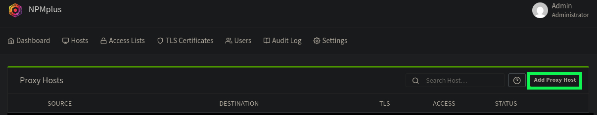
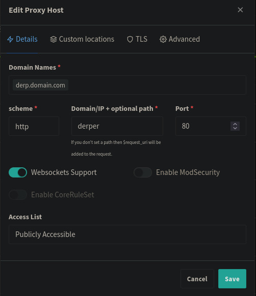
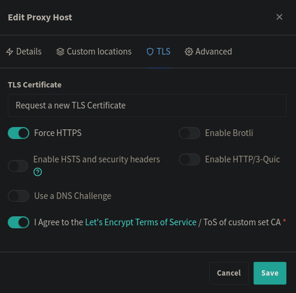

## What is this for? 
This guide is for people who want to run their own DERP server for their Tailscale network (Tailnet) or for their own self-hosted Headscale Tailnet. This guide will go over how to setup a custom DERP relay for Tailscale in certain conditions. You will be able to setup a DERP relay using a non-standard HTTPS port or behind a reverse proxy. The DERP relay that will be used is [fredliang/derper](https://github.com/fredliang44/derper-docker)

## Requirements
- A Linux server with Docker to host a DERP relay on
- A domain or dedicated subdomain pointed towards the server 
- The ability to expose ports on your server to the internet
- Prior knowledge on configuring and managing remote servers

## Non-Standard HTTPS port
You may already have a public server that you have lying around, but it has ports 80 and 443 taken up by a reverse proxy like NGINX or Traefik. In my case, I have a public VPS to host some simple Docker services like Gotify and PsiTransfer. Those services are behind [Nginx Proxy Manager+](https://github.com/ZoeyVid/NPMplus) and using that for TLS and fun wildcard domains. 

No worries! You can host the DERP relay on a non-standard HTTPS port. It's relatively simple. 

1. Make a new folder for the DERP relay and enter it

```sh
mkdir derper && cd derper
```

2. Add a folder to the DERP relay folder

```sh
mkdir certs
```

3. Make a `docker-compose.yaml` and open it

```sh
touch docker-compose.yml
nano docker-compose.yml
```

4. Edit `docker-compose.yaml` to have this text

```yaml
services:
  derper:
    image: fredliang/derper
    container_name: derper
    restart: always
    ports:
      - 3478:3478/udp
      - 8443:443
    environment:
      - DERP_DOMAIN=derp.domain.com
      - DERP_ADDR=:443
      - DERP_HTTP_PORT=-1
      - DERP_CERT_MODE=manual
    volumes:
      - ./certs/fullchain.pem:/app/certs/derp.domain.crt:ro
      - ./certs/privkey.pem:/app/certs/derp.domain.key:ro
```
- Don't forget to change `derp.domain` to the domain or subdomain you have setup for the server. If needed, change port 8443 to some other non-standard port. 
- You will need to expose the non-standard HTTPS port and STUN port. You may need to go to your server provider's firewall to open the port as well as on the server itself. 

5. Get Let's Encrypt HTTPS certificates for your domain. 

You'll need an A record on your DNS provider that points your domain or subdomain to your server's IP. After that, you run a tool like Certbot to grab a certificate for your domain using the HTTP-01 challenge. Make sure that the server has ports 80 and 443 open. Once you get your certificates, you can point the volumes in `docker-compose.yml` to the location of your `fullchain.pem` and `privkey.pem` or paste your certificates into your `certs` folder. 

6. Spin up the DERP relay!
```sh
docker compose up -d
```

## Behind a reverse proxy
You can also host a DERP relay behind your reverse proxy and run it behind ports 80 and 443. 
This guide will go over setting up a DERP relay behind [Nginx Proxy Manager+](https://github.com/ZoeyVid/NPMplus)

### How does this work?
Normally, the DERP port will be 443 and you will be forced to use TLS. This usually doesn't work very well with reverse proxies, which people usually use to handle TLS to their services. 

However, if you use 80 as the DERP port, it will not use TLS, and serve normal HTTP. This would allow the reverse proxy to take over, and allow it to handle TLS for the DERP relay. 

### Setting up Nginx Proxy Manager+ (NPM+)
1. Make a new folder for NPM+ and enter it

```sh
mkdir npm-plus && cd npm-plus
```

2. Add a `data` folder to the NPM+ folder

```sh
mkdir data
```

3. Make a `docker-compose.yaml` and open it

```sh
touch docker-compose.yml
nano docker-compose.yml
```

4. Edit `docker-compose.yaml` to have this text

```yaml
services:
  npmplus:
    container_name: npmplus
    image: docker.io/zoeyvid/npmplus:latest # or ghcr.io/zoeyvid/npmplus:latest
    restart: always
    networks:
      - proxy
    dns:
      - 1.1.1.1
    ports:
      - 80:80
      - 443:443
      - 81:81
    volumes:
      - "./data:/data"
    environment:
      - "TZ=America/Chicago" # set timezone, required, set it to one of the values from the "TZ identifier" https://en.wikipedia.org/wiki/List_of_tz_database_time_zones#List
networks:
  proxy:
    external: true
``` 
- You will need to expose the ports 80 and 443. You may need to go to your server provider's firewall to open the port on their side as well as on the server itself. 
- Port 81 will also have to be exposed for NPM+'s admin panel. You can setup the panel behind a domain or subdomain and not need to expose port 81. 

5. Create a Docker network for NPM+
```sh
docker network create proxy
```

6. Spin up NPM+
```sh
docker compose up -d
```

7. Return to the starting folder 
```sh
cd ..
```

### Setting up the DERP relay
1. Make a new folder for the DERP relay and enter it

```sh
mkdir derper && cd derper
```

2. Make a `docker-compose.yaml` and open it

```sh
touch docker-compose.yml
nano docker-compose.yml
```

3. Edit `docker-compose.yaml` to have this text

```yaml
services:
  derper:
    image: fredliang/derper
    container_name: derper
    restart: always
    ports:
      - 3478:3478/udp
    networks:
      - proxy
    environment:
      - DERP_DOMAIN=derp.domain.com
      - DERP_ADDR=:80
      - DERP_HTTP_PORT=80
networks:
  proxy:
    external: true
```
- Don't forget to change `derp.domain` to the domain or subdomain you have setup for the server.  
- You will need to expose the STUN port. You may need to go to your server provider's firewall to open the port as well as on the server itself. 

4. Spin up the DERP relay!
```sh
docker compose up -d
```

### Configuring NPM+ for the DERP relay
This assumes you've completed the first time setup for NPM+ and can access the admin panel. 

1. Add a new `Proxy Host`

 

2. On the `Details` tab
- Add your DERP domain or subdomain to your `Domain Names`
- Set the `Domain/IP + optional path` to `derper`
- Set the `Port` to 80

 

3. On the `TLS` tab
- Request a new certificate
- Agree to Let's Encrypt Terms of Service
- Force HTTPS

 

4. Save the configuration

## Testing connectivity to the DERP server
This assumes you have Tailscale installed on your client and can use the Tailsclae CLI. 
To add your DERP server to your Tailnet, you can follow the steps provided by Tailscale [here](https://tailscale.com/kb/1118/custom-derp-servers#add-the-custom-derp-servers-to-your-tailnet). 

Once you have added it to your Tailnet policy, you can test connectivity to your DERP relay using `tailscale debug derp <region-id>`. 
An successful DERP connection will look something like this. 
```json
{
 "Info": [
  "Region 998 == \"random-vps-derp\"",
  "Successfully established a DERP connection with node \"derp.domain.com\"",
  "Node \"derp.domain.com\" returned IPv4 STUN response: client-ip:41017"
 ],
 "Warnings": null,
 "Errors": [
  "Error connecting to node \"derp.domain.com\" @ \"derp.domain.com:443\" over IPv6: dial tcp6: lookup derp.domain.com on 127.0.0.53:53: no such host"
 ]
}
```
I got an error as I don't have an IPv6 IP for my domain. The DERP server works regardless of that error. 


You can also test latency to your DERP server using `tailscale netcheck` and viewing the resultant report. 
```
Report:
	* Time: 2025-08-01T20:14:54.12745344Z
	* UDP: true
	* IPv4: yes, client-ip:40784
	* IPv6: no, but OS has support
	* MappingVariesByDestIP: false
	* PortMapping: UPnP, NAT-PMP
	* Nearest DERP: <obfuscated for privacy>
	* DERP latency:
		- random-vps-derp: 36.3ms  (random-vps)
        ...
        <other relay servers>
        ...
```

You can also run `tailscale debug derp-map` in order to get an list of all available DERP servers for your Tailnet. Your DERP server should look like this
```json
"998": {
			"RegionID": 998,
			"RegionCode": "random-vps-derp",
			"RegionName": "random-vps",
			"Nodes": [
				{
					"Name": "998",
					"RegionID": 998,
					"HostName": "derp.domain.com",
					"IPv4": "server.ip",
					"STUNPort": 3478,
					"DERPPort": 443
				}
			]
		},
```