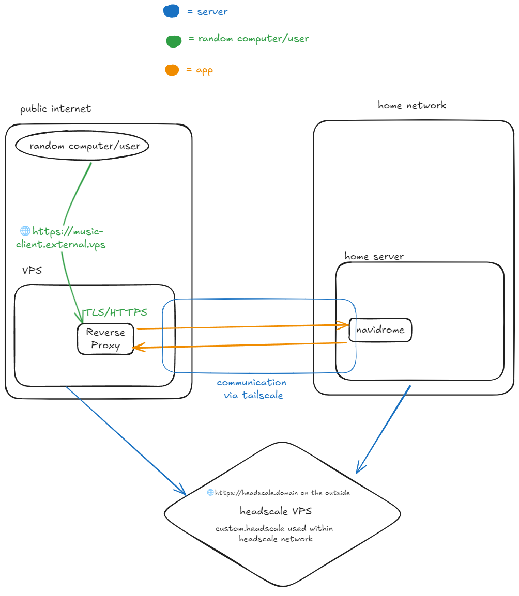

## Introduction
If you run Headscale, or are paranoid and severely distrust everyone, you're gonna be missing out on a fun feature of Tailscale, namely `tailscale funnel`. This allows for a service on your tailnet to be exposed to the internet, under a subdomain of your own `name.ts.net` domain. You also get a nice HTTPS certificate from Let's Encrypt for that domain. 

This process works by routing the app through Tailscale's servers and publicly exposing it through them. The specifics about how Funnel works is available on their [docs](https://tailscale.com/kb/1223/funnel).

Now this is nice and all, but what if you want to be more independent, or are running Headscale? Once you start running your own Tailscale coordination server using a service like Tailscale, you can't use Tailscale's servers to basically proxy your home services and expose them to the outside internet. However, you can start rolling out your own version of `tailscale funnel`. It's not as elegant as Tailscale's own implementation, but its still pretty capable. You do this by running your own VPS as a replacement for Tailscale's servers. 

## How it works
The way that this works is pretty simple. Your VPS and home server would both be connected to the same Headscale tailnet. You would have a service on your home server accessible that is accessible to that VPS. On the VPS, you would then reverse proxy that connection, making the service accessible under a nice domain and with HTTPS. You're getting a domain and HTTPS as the domain belongs to the VPS, and the VPS is also handling TLS via its own reverse proxy. 

Below is a simple diagram of how this setup would work using an example service like Navidrome, a self-hosted music server.



## Setup 
For this, you'll need a few things. 
- A VPS running Headscale
- A publicly accessible VPS
- Your internal server

Once you have the required things, you can start making your own makeshift proxy!

1. Connect both your public VPS, and your internal server to your Headscale tailnet. 

2. Verify that both your VPS and internal server can communicate via their Tailscale connections. 
    - You can do this by having one machine ping the other via their Tailscale hostnames, or through their Tailscale IPs.

3. Once you've connected the machines to your Headscale network and verified that they can talk to each other via Tailscale, you have a few ways of setting up a service to be Tailscale-accessible. 
    - If your service is set up to listen to all interfaces on a specific port, you can just try to access the service using the Tailscale IP or the Tailscale domain with the corresponding port. `curl`ing the IP and port combination is a great way to test reachability. 
    - You can setup the service to listen in on the Tailscale interface on a specific port.  
4. (Optional) After that, you can choose to set up an ACL to further lock down the public VPS's access into your Tailnet. Headscale ACLs follow the same syntax and general concepts as standard Tailscale ACLs, so more information can be found [here](https://tailscale.com/kb/1018/acls). Below is a snippet of my ACL that I've made for my own use. Names and specific IPs have been obfuscated and replaced with generics. 
```json
{
    "acls":[

    { "action": "accept", "src": ["public-vps"], "dst": ["home-server:4533"] },
    ... (other parts of my config)
    "hosts":{
        "home-server": "100.64.0.2",
        "public-vps": "100.64.0.3",
        ... (other hosts)
    }
}

```
## VPS setup
Now all you need to do on the VPS is to just run a reverse proxy. Depending on the service, you might need to set it up in a special way. However, in this case its relatively simple. All I would need to do is to configure a route to the remote service, which can be done in any reverse proxy of your choice. I will just go over how to configure it in Traefik as that's the reverse proxy I use on my VPS, but the similar concept applies to all other popular reverse proxies like Caddy, and Nginx. 

This assumes that you have a Traefik instance already setup.
In your dynamic configuration file, you'll add this set of text.
```yaml
http:
    routers:
        rule: Host('music.domain.com')
    services:
        music-server:
            loadbalancers:
                servers:
                    - url: http://100.64.0.1:4533
```